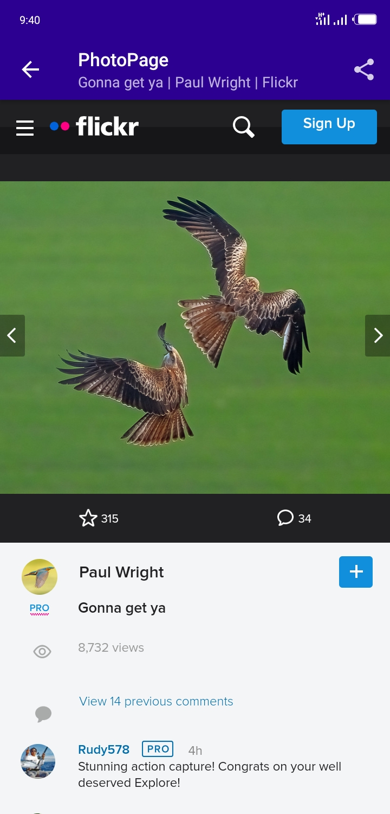

# PhotoGallery
PhotoGallery is an app that fetches and displays the most interesting public photos of the day from [Flickr](https://www.flickr.com).
 
 ## Screenshots
 
 
 
 

 ## Features
 * User can search for specific photos like "dog" or "sky" and get desired results.
 * With a click on any photo, a web view will pop up, showing more details of the clicked photo on [the Flickr webpage](https://www.flickr.com) while still on the app.
 * Supports dark mode.
 * In the app settings, user can toggle dark mode on or off.
 * It is also possible to choose web view from three available options in the settings.
 * Notification pops up when there are new pictures but the app is not currently in use.
 * With one of the web views comes a nice functionality - sharing photo link through any other app.
 * The app stores user's search history, thanks to Room, which is displayed in a dialog.

 ## Libraries
  * [Retrofit](https://github.com/square/retrofit)
  * [Gson](https://github.com/google/gson)
  * [WorkManager](https://developer.android.com/topic/libraries/architecture/workmanager)
  * [Room](https://developer.android.com/jetpack/androidx/releases/room)
  * [Kotlin Coroutines](https://developer.android.com/kotlin/coroutines)
  * Other Android Architectural Components ([ViewModel](https://developer.android.com/topic/libraries/architecture/viewmodel), [LiveData](https://developer.android.com/topic/libraries/architecture/livedata))
